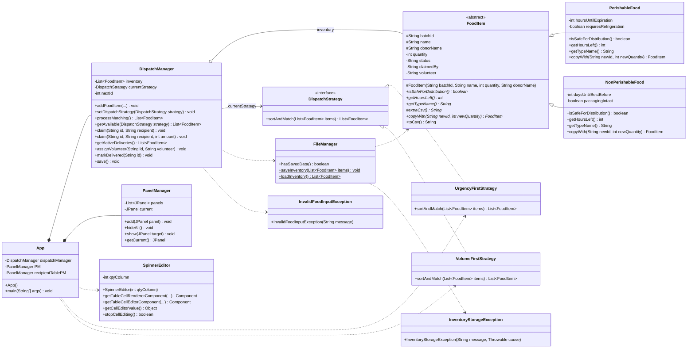

```mermaid
classDiagram
    direction LR

    class FoodItem {
        <<abstract>>
        #String batchId
        #String name
        #String donorName
        -int quantity
        -String status
        -String claimedBy
        -String volunteer
        #FoodItem(String batchId, String name, int quantity, String donorName)
        +isSafeForDistribution()* boolean
        +getHoursLeft()* int
        +getTypeName()* String
        #extraCsv()* String
        +copyWith(String newId, int newQuantity)* FoodItem
        +toCsv() String
    }

    class PerishableFood {
        -int hoursUntilExpiration
        -boolean requiresRefrigeration
        +isSafeForDistribution() boolean
        +getHoursLeft() int
        +getTypeName() String
        +copyWith(String newId, int newQuantity) FoodItem
    }

    class NonPerishableFood {
        -int daysUntilBestBefore
        -boolean packagingIntact
        +isSafeForDistribution() boolean
        +getHoursLeft() int
        +getTypeName() String
        +copyWith(String newId, int newQuantity) FoodItem
    }

    class DispatchStrategy {
        <<interface>>
        +sortAndMatch(List~FoodItem~ items) List~FoodItem~
    }

    class UrgencyFirstStrategy {
        +sortAndMatch(List~FoodItem~ items) List~FoodItem~
    }

    class VolumeFirstStrategy {
        +sortAndMatch(List~FoodItem~ items) List~FoodItem~
    }

    class DispatchManager {
        -List~FoodItem~ inventory
        -DispatchStrategy currentStrategy
        -int nextId
        +addFoodItem(...) void
        +setDispatchStrategy(DispatchStrategy strategy) void
        +processMatching() List~FoodItem~
        +getAvailable(DispatchStrategy strategy) List~FoodItem~
        +claim(String id, String recipient) void
        +claim(String id, String recipient, int amount) void
        +getActiveDeliveries() List~FoodItem~
        +assignVolunteer(String id, String volunteer) void
        +markDelivered(String id) void
        +save() void
    }

    class FileManager {
        +hasSavedData()$ boolean
        +saveInventory(List~FoodItem~ items)$ void
        +loadInventory()$ List~FoodItem~
    }

    class PanelManager {
        -List~JPanel~ panels
        -JPanel current
        +add(JPanel panel) void
        +hideAll() void
        +show(JPanel target) void
        +getCurrent() JPanel
    }

    class SpinnerEditor {
        -int qtyColumn
        +SpinnerEditor(int qtyColumn)
        +getTableCellRendererComponent(...) Component
        +getTableCellEditorComponent(...) Component
        +getCellEditorValue() Object
        +stopCellEditing() boolean
    }

    class App {
        -DispatchManager dispatchManager
        -PanelManager PM
        -PanelManager recipientTablePM
        +App()
        +main(String[] args)$ void
    }

    class InvalidFoodInputException {
        +InvalidFoodInputException(String message)
    }

    class InventoryStorageException {
        +InventoryStorageException(String message, Throwable cause)
    }
    FoodItem <|-- PerishableFood
    FoodItem <|-- NonPerishableFood

    DispatchStrategy <|.. UrgencyFirstStrategy
    DispatchStrategy <|.. VolumeFirstStrategy

    DispatchManager o-- FoodItem : inventory
    DispatchManager --> DispatchStrategy : currentStrategy
    DispatchManager ..> FileManager
    DispatchManager ..> InvalidFoodInputException
    FileManager ..> FoodItem
    FileManager ..> InventoryStorageException

    App *-- DispatchManager
    App *-- PanelManager
    App ..> SpinnerEditor
    App ..> UrgencyFirstStrategy
    App ..> VolumeFirstStrategy
```